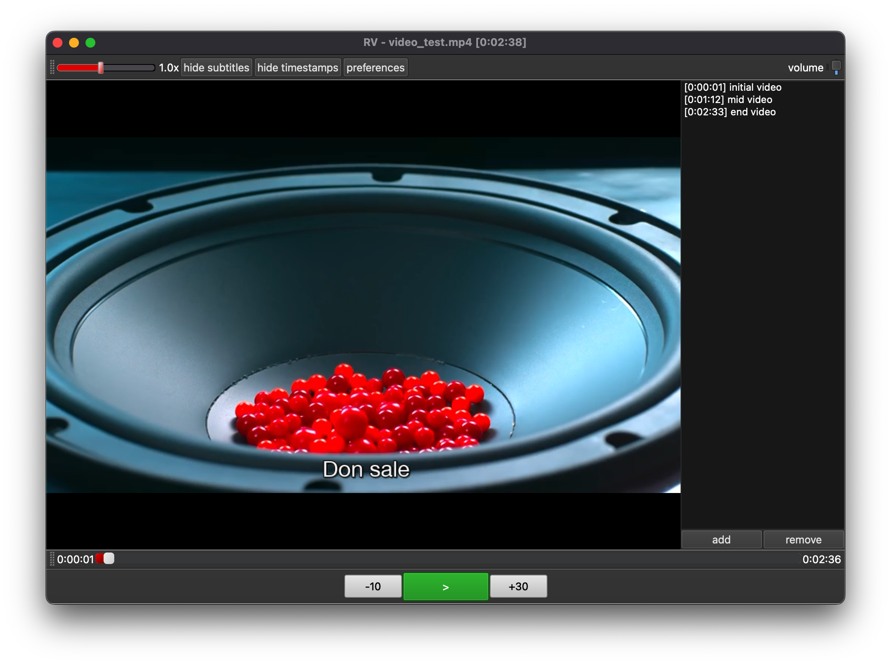
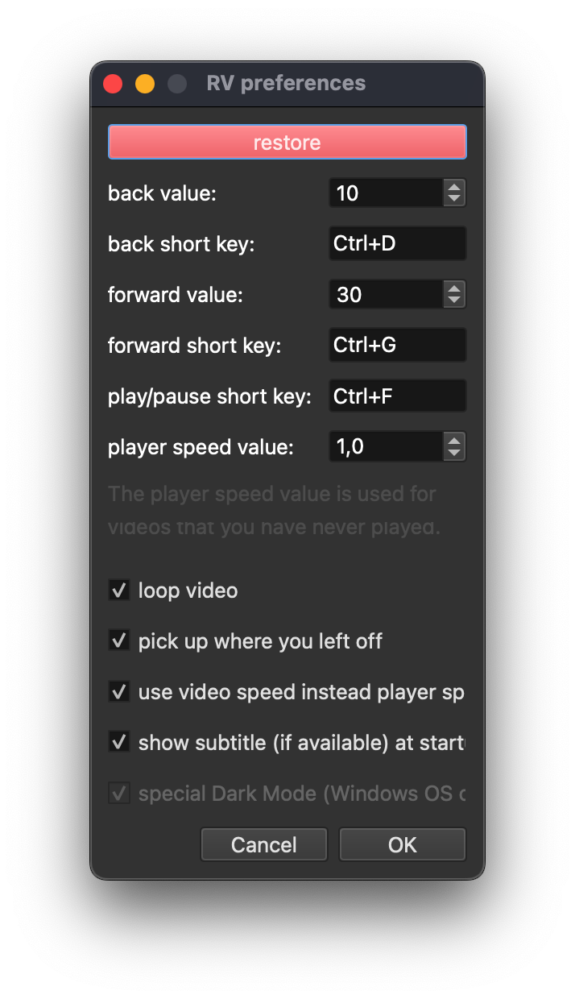
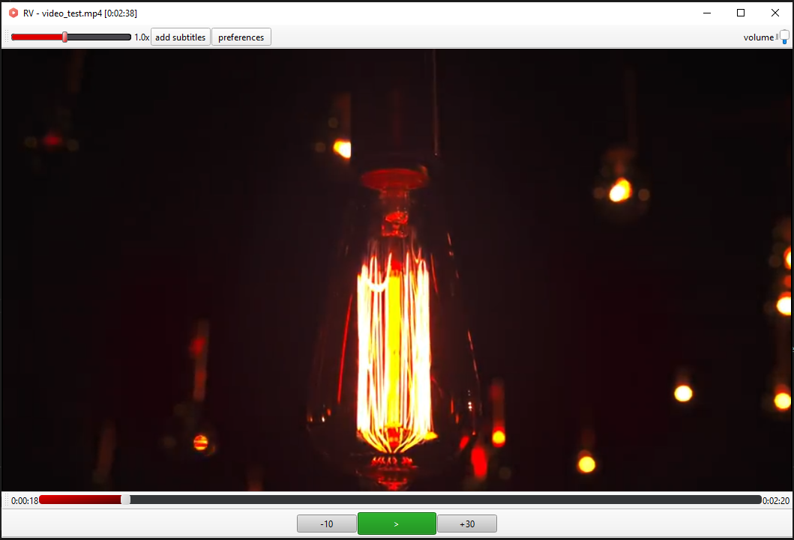
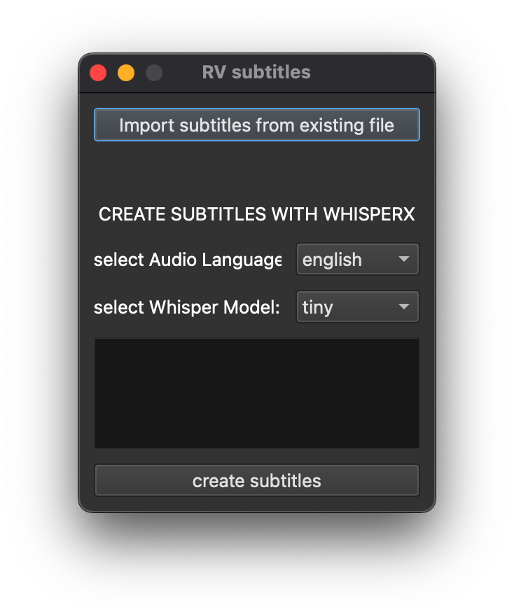

# RViewer
Rviewer is a VLC media player that can generate subtitle using OpenAI Whisper Model. It's a personal project that I developed because I wanted to create a video player that was comfortable to use for many hours a day for video lessons (or in general to analyze a video).

## prerequisites:
- python3 
- <a href="https://www.videolan.org/vlc/index.it.html">VLC program</a></li>
- [Optional] (to generate subtitles): <a href="https://ffmpeg.org/download.html">ffmpeg</a></li>ffmpeg program 

## libraries:
- python-vlc, pyside6
- [Optional] (to generate subtitles): ffmpeg-python, openai-whisper, torch

## hardware requirements (to generate subtitles):
- Windows/MacOS/Linux
- at least 2GB free space for libraries/models
- at least 1GB VRAM for OpenAI Tiny Model, 2GB VRAM for Small Model

## setup
**to-do**

## tips
- (Subtitle): use CUDA if you have a NVIDIA GPU: it will be faster. Check if torch.cuda is available with: `test_torch.py`.
This helped me: https://github.com/pytorch/pytorch/issues/30664#issuecomment-757431613
- change CSS files if you want a different styles for bars.

## solutions
- [MacOS]: if you get error `SSL: CERTIFICATE_VERIFY_FAILED` try to install `certifi` or upgrade it.

## possible future updates
1. handle more subtitles
2. create a window for subtitles
3. add css for more gui objects
4. add code documentation
5. handle playlists
6. handle youtube videos
7. Generate audio transcript from subtitles
8. vocal commands
9. Stream video with a friend

## credits
<a href="https://www.flaticon.com/free-icons/music-and-multimedia" title="music-and-multimedia icons">Program Icon created by Azland Studio - Flaticon</a>

## Outputs
 

  
