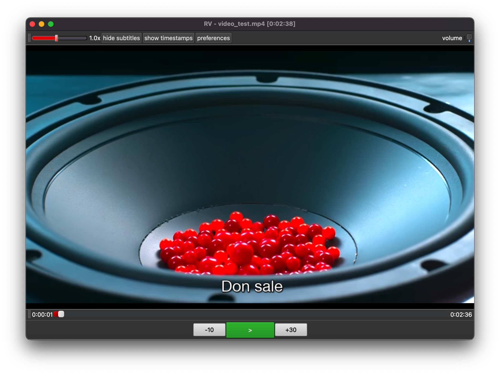
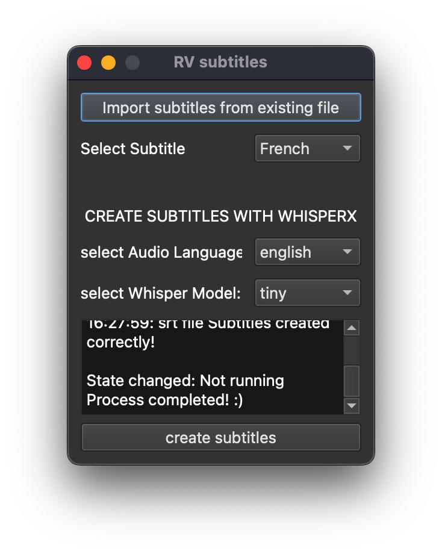
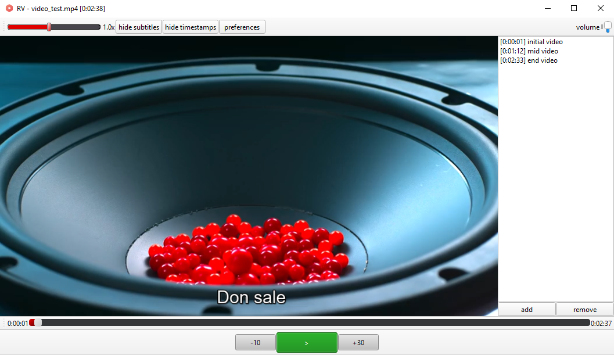

# RViewer
RViewer is a VLC media player that can generate subtitle using OpenAI Whisper Model. It's a personal project that I developed because I wanted to create a video player that was comfortable to use for many hours a day for video lessons (or in general to analyze video).
<b>In particular, I used <a href="https://github.com/m-bain/whisperX">WhisperX</a></li>.</b>

https://github.com/Luruu/RViewer/assets/31493347/c1a90980-2d77-4563-afaa-652628b690c8

## prerequisites:
- python3 
- <a href="https://www.videolan.org/vlc/index.it.html">VLC program</a></li>
- [Optional] (to generate subtitles): <a href="https://ffmpeg.org/download.html">ffmpeg program</a></li> 

## libraries:
- python-vlc, pyside6
- [Optional] (to generate subtitles): ffmpeg-python, whisperx, torch

## hardware requirements (to generate subtitles):
- Windows/MacOS/Linux
- at least 2GB free space for libraries/models
- at least 1GB VRAM for OpenAI Tiny model, 3GB VRAM for Small model

## setup
1. Open a terminal and clone the repo: `gh repo clone Luruu/RViewer` (or download it manually)
2. Move to RViewer folder: `cd RViewer`
3. Create and activate a virtual environment: 
    - Linux/MacOS: `python3 -m venv env` and `source env/bin/activate`
    - Windows: `py -m venv env` and `.\env\Scripts\activate`
4. Install libraries: `pip install pyside6 python-vlc git+https://github.com/m-bain/whisperx.git`

note: you must have the VLC program installed to be able to view the videos (and open RViewer) and the ffmpeg program to be able to use whisper.

## tips
- (Subtitle): use CUDA if you have a NVIDIA GPU: it will be faster. Check if torch.cuda is available with: `test_torch.py`.
This helped me to activate it: https://github.com/pytorch/pytorch/issues/30664#issuecomment-757431613
- change content of CSS files if you want to change object styles
- change `vlc_args.txt` in preferences folder if you want to change the behavior of vlc (for example, to change subtitle font, size and so on)

## solutions
- [MacOS]: if you get error `SSL: CERTIFICATE_VERIFY_FAILED` try to install `certifi` or upgrade it.

## possible future updates
1. add code documentation
2. handle playlists
3. handle youtube videos
4. Generate audio transcript from subtitles
5. vocal commands
6. Stream video

## credits
<a href="https://www.flaticon.com/free-icons/music-and-multimedia" title="music-and-multimedia icons">Program Icon created by Azland Studio - Flaticon</a>

## Outputs

 
 
 

  

